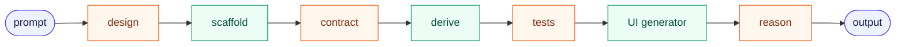
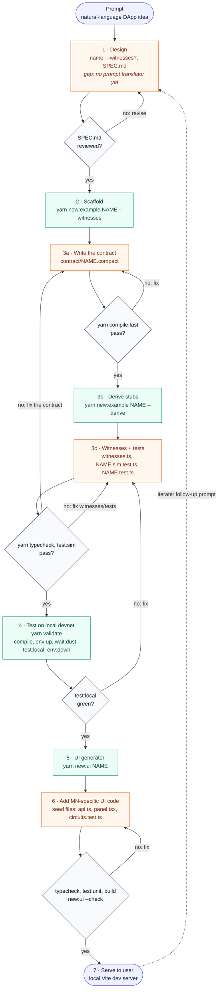

# The scripted generation pipeline

> **Status: living draft.** This is the working definition of the scripted
> generation pipeline: how a prompt becomes a running DApp using the scripts and
> references in this repo. Expect it to change as the pipeline is refined. Edit
> it here and note the change in the [changelog](#changelog).

The pipeline alternates between two kinds of work. **Scripts** are
deterministic and run with no AI. **Reasoning steps** are where a model writes
Midnight-specific code from the repo's references. Every reasoning step ends at
a gate: a human review of the design, or a mechanical check (compile,
typecheck, in-memory tests, devnet tests, build). A failure at a gate loops
back to that reasoning step, so code only moves forward once it compiles and
runs. The gates get slower as the flow goes on (seconds for `compile:fast`,
`typecheck` and `test:sim`; minutes for the devnet), so most mistakes are
caught before the devnet starts.

## Skeleton

## Flow

After a contract change in 3c, or a change to the `create<X>PrivateState`
factory in `witnesses.ts`, re-run `yarn compile:fast` and
`yarn new:example NAME --derive`: derive only rewrites stub regions nobody has
edited, so it picks up new circuits, constructor parameters and factory
parameters without touching written code.

Colour key: indigo marks input/output, green a deterministic script, orange a
reasoning (LLM) step, and slate a mechanical gate. Dashed grey marks a step with
nothing behind it yet.

## Steps

| # | Step | Kind | Runs | Reads | Writes | Gate |
|---|------|------|------|-------|--------|------|
| 1 | Design | reason | Model drafts the design card; it is saved into the `SPEC.md` that step 2 scaffolds | User prompt; [`templates/example/SPEC.md`](../templates/example/SPEC.md) and the worked example [`examples/private-tip-jar/SPEC.md`](../examples/private-tip-jar/SPEC.md) | Example name (kebab-case), whether it needs witnesses, and the content of `SPEC.md`: roles, public fields, circuits and their asserts, witnesses, **privacy invariants** and **accepted leaks** | A human reviews the design before any code exists; the name matches `NAME_RE`; `--witnesses` matches SPEC's Witnesses section. (**Gap**: nothing turns a prompt into this yet) |
| 2 | Scaffold | script | `yarn new:example <name> [--witnesses] [--no-register]` ([`scripts/new-example.mjs`](../scripts/new-example.mjs)) | [`templates/example/`](../templates/example/) | `examples/<name>/`: `SPEC.md` (step 1's card goes here), contract stub, `src/` harness, an in-memory test (`<name>.sim.test.ts`) and a devnet test skeleton with `@generated-stub` regions, `compose.yml`, `AGENTS.md`. Registers the example in CI and the docs tables | Node 22, `compact` at the CI pin ([`scripts/lib/preflight.mjs`](../scripts/lib/preflight.mjs)); unknown flags rejected; registration succeeded; no leftover template tokens |
| 3a | Write the contract | reason | Model writes Compact | See [Context budget](#context-budget) | `contract/<name>.compact` | `yarn compile:fast` (`--skip-zk`: no proving keys, under a second for most contracts); on failure, back to 3a |
| 3b | Derive stubs | script | `yarn new:example <name> --derive` ([`scripts/lib/derive.mjs`](../scripts/lib/derive.mjs)) | `contract/managed/<name>/compiler/contract-info.json`, `contract/index.d.ts`, `contract/<name>.compact`, `contract/witnesses.ts` | Fills the unedited `@generated-stub` regions: a typed stub per witness, constructor `args` in both tests' deploy calls, an `it.todo` per circuit, the ledger fields, a privacy-test skeleton | Refuses if the contract isn't compiled or declares witnesses without `witnesses.ts`. Re-runnable: edited regions are left alone, and a second run changes nothing |
| 3c | Witnesses and tests | reason | Model writes code | See [Context budget](#context-budget) | Witness bodies in `contract/witnesses.ts`; `src/test/<name>.sim.test.ts` (logic, a negative test per assert, one `assertNotInPublicState` entry per SPEC privacy invariant); `src/test/<name>.test.ts` (the end-to-end flow) | `yarn typecheck` and `yarn test:sim` (in memory, no Docker, seconds) pass; on failure, back to 3c (or 3a for a contract bug) |
| 4 | Test on local devnet | script | `yarn validate [--keep-net]` ([`scripts/validate-example.mjs`](../scripts/validate-example.mjs)) = `compile` (if a `.compact` changed or `managed/` has no proving keys, as after `compile:fast`) → `env:up` → `wait:dust` → `test:local` → `env:down` | `examples/<name>/compose.yml` (proof server, indexer, node) | Test results; `logs/compose.log` on failure | Exits with the failing step's status; on failure, back to 3c. `--keep-net` keeps the network up between fix attempts. **Must pass before step 5** |
| 5 | UI generator | script | `yarn new:ui <name> [--contract <managed-dir>] [--private-state memory\|persistent]` ([`scripts/new-ui.mjs`](../scripts/new-ui.mjs)); preview with `--dry-run` | `contract/managed/<c>/compiler/contract-info.json`, `contract/managed/<c>/contract/index.d.ts`, `contract/witnesses.ts`, `contract/<c>.compact`, and [`templates/ui/`](../templates/ui/) | `examples/<name>/ui/` (Vite + React): template-owned files, seed files, `new-ui.json`, `verification.json` | Refuses when the contract isn't compiled, `ui/` already exists, or `witnesses.ts` lacks a `create<X>PrivateState` factory |
| 6 | Add MN-specific UI code | reason | Model edits seed files only | [`templates/ui/AGENTS.md`](../templates/ui/AGENTS.md) (copied into every `ui/AGENTS.md`); existing `examples/*/ui/` | `src/midnight/<name>-api.ts`, `src/components/<name>-panel.tsx`, `src/__tests__/<name>-circuits.test.ts`, `README.md` | `typecheck`, `test:unit` and `build` pass; `yarn new:ui <name> --check` shows no template drift; on failure, back to 6 |
| 7 | Serve to user | output | `yarn workspace @midnight-ntwrk/example-<name>-ui dev` (runs `copy:zk`, then Vite on :5173); `yarn fund:wallet` funds a browser wallet on devnet | Built UI, managed ZK assets | Running DApp | Browser and Lace checks recorded in `ui/verification.json` |

## Context budget

A reasoning step costs the tokens it reads. Read in this order, and stop once
you have what you need.

| Step | Read | Don't read |
|---|---|---|
| 1 (design) | [`templates/example/SPEC.md`](../templates/example/SPEC.md); [`examples/private-tip-jar/SPEC.md`](../examples/private-tip-jar/SPEC.md) as a worked example; [`patterns.md`](patterns.md) to find the nearest example | Any code |
| 3a (contract) | [`compact-gotchas.md`](compact-gotchas.md) (~1.5K tokens); [`patterns.md`](patterns.md) (~1.5K tokens) to pick the 1–2 nearest examples; their `contract/*.compact`; this example's `SPEC.md` | `src/wallet.ts`, `src/providers.ts`, `src/config.ts`, `scripts/wait-for-dust.ts`, `compose.yml` (identical in every example); the narrative parts of `TUTORIAL.md` and `LESSONS.md`; examples unrelated to the use case |
| 3c (witnesses, tests) | The derived stubs; the nearest examples' `contract/witnesses.ts` and test bodies after `Your tests begin here`; `examples/calculator/src/test/calculator.sim.test.ts` and `examples/private-tip-jar/src/test/private-tip-jar.sim.test.ts` as models, and [`packages/sim/src/sim.ts`](../packages/sim/src/sim.ts) / [`privacy.ts`](../packages/sim/src/privacy.ts) if you need more of the in-memory API. If the nearest example's devnet test body calls helpers defined above its marker (multi-wallet or shielded-coin setup, as in `private-tip-jar`), read those helpers too. A second contract (a test token): `private-tip-jar`'s `contract/index.ts` and `package.json` compile scripts | The rest of the setup above a test's marker; `contract/managed/` beyond the generated `index.d.ts` |
| 3, on a gate failure | The failing gate's output first. If `compact-gotchas.md` doesn't explain it, then the `midnight-expert` skills (`compact-core`, `midnight-verify`) or the linked `LESSONS.md`/`TUTORIAL.md` section | All of `TUTORIAL.md` |
| 6 (UI seed files) | [`templates/ui/AGENTS.md`](../templates/ui/AGENTS.md) §3 and §5 and the Gotchas; the nearest `examples/*/ui/` seed files (listed under its "Worked examples") | Template-owned UI files; `examples/zk-loan/ui` (hand-built, not authoritative) |

Root and per-example `AGENTS.md` files (about 20 KB together) may be loaded
automatically when an agent works in an example directory; count them in the
budget.

`yarn compile:fast`, `yarn typecheck` and `yarn test:sim` take seconds;
`yarn validate` takes minutes (a full compile with proving keys, then the
devnet). Put contract logic, every guard and the privacy invariants in the
in-memory test, so the devnet run only has to confirm the end-to-end flow.

## Known gaps and open items

- **Prompt → design (step 1).** Nothing derives the example name, the
  `--witnesses` choice or the SPEC.md draft from a prompt yet, and nothing
  checks the card (required headings, `--witnesses` matching its Witnesses
  section). Phase 3's runner is the place for that lint.
- **No end-to-end runner.** Each step is a separate command, and `yarn validate`
  only covers step 4. Something has to chain steps 2–7 and drive the fix
  loops.
- **`--derive` covers one contract.** It fills the stubs of the contract named
  after the example. A second contract (a demo token, as in
  `private-tip-jar`) is wired by hand.
- **No shared shielded test faucet or coin helpers.** Examples that need
  shielded coins in their devnet tests write a small minting contract
  (`private-tip-jar`'s `tip-token.compact`) and port about 130 lines of
  two-wallet and coin-selection setup. The in-memory tests don't need either:
  `Sim` takes made-up coins. The SPEC template has no place for such a
  test-only contract yet.
- **Serving (step 7).** Serving stops at the local Vite dev server; there is no
  deploy target in this repo.
- **Browser verification.** The checks in `verification.json` (Lace, browser)
  are run by hand. Decide which of them a pipeline can run automatically before
  serving.

## Changelog

- 2026-10-07: Phase 2. Step 1 now writes a `SPEC.md` design card that a human
  reviews before any code. Step 3 is split: 3a writes the contract and gates
  on `yarn compile:fast` (`--skip-zk`); 3b runs `yarn new:example <name>
  --derive`, which fills `@generated-stub` regions from the compiled contract;
  3c writes witnesses and tests and gates on `yarn typecheck` and `yarn
  test:sim` (in memory, via `packages/sim`, no Docker). CI runs `test:sim`
  before the devnet. Every example's test now has a `Your tests begin here`
  marker, and the template wallet has `splitShieldedCoin`. After the Phase 2
  baseline run (`reports/generation-baseline.json`): the initial private
  state in both tests is a derived region too, and the step-3c budget points
  at the helpers a multi-wallet devnet test needs.

- 2026-10-06: `yarn validate` exits with the failing step's status (it used to
  exit with `env:down`'s, so failing tests passed the gate), compiles first
  when needed, and takes `--keep-net`. Added `typecheck` to every example and
  as a CI step, preflight checks, strict `new:example` flags, and a context
  budget backed by `docs/compact-gotchas.md` and `docs/patterns.md`.
- 2026-10-06: First draft of the 7-step flow (prompt, scaffold, generate,
  devnet test, UI generator, UI code, serve).
