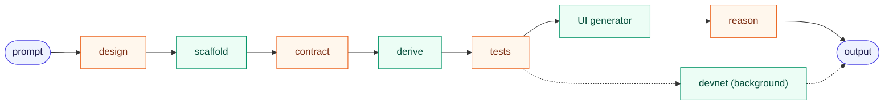
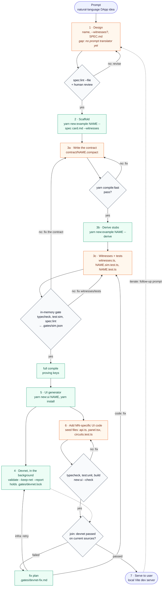

# The scripted generation pipeline

> **Status: living draft.** This is the working definition of the scripted
> generation pipeline: how a prompt becomes a running DApp using the scripts and
> references in this repo. Expect it to change as the pipeline is refined. Edit
> it here and note the change in the [changelog](#changelog).

The pipeline alternates between two kinds of work. **Scripts** are
deterministic and run with no AI. **Reasoning steps** are where a model writes
Midnight-specific code from the repo's references. Every reasoning step ends at
a gate: a human review of the design, or a mechanical check (spec lint,
compile, typecheck, in-memory tests, devnet tests, build). A failure at a gate
loops back to that reasoning step, so code only moves forward once it compiles
and runs. The in-memory gate (`typecheck`, `test:sim`, the SPEC code checks)
takes seconds and catches the contract logic, every guard and the privacy
invariants, so it is what unlocks the UI. The devnet takes minutes, mostly real
proving in `test:local`, so it runs **in the background** while the UI is
written, and must pass before the example is done. `yarn pipeline <name>` runs
the scripts and gates in order and says what to do next; see
[Running it](#running-it-yarn-pipeline).

## Skeleton

## Flow

After a contract change in 3c, or a change to the `create<X>PrivateState`
factory in `witnesses.ts`, re-run `yarn compile:fast` and
`yarn new:example NAME --derive`: derive only rewrites stub regions nobody has
edited, so it picks up new circuits, constructor parameters and factory
parameters without touching written code.

Colour key: indigo marks input/output, green a deterministic script, orange a
reasoning (LLM) step, and slate a mechanical gate. Dashed grey marks a step with
nothing behind it yet.

## Steps

| # | Step | Kind | Runs | Reads | Writes | Gate |
|---|------|------|------|-------|--------|------|
| 1 | Design | reason | Model drafts the design card; `new:example --spec` makes it the example's `SPEC.md` | User prompt; [`templates/example/SPEC.md`](../templates/example/SPEC.md) and the worked example [`examples/private-tip-jar/SPEC.md`](../examples/private-tip-jar/SPEC.md) | Example name (kebab-case), whether it needs witnesses, and the content of `SPEC.md`: roles, public fields, circuits and their asserts, witnesses, **privacy invariants** and **accepted leaks** | `yarn spec:lint --file <card> [--witnesses]`: every section filled in, tables with rows, each privacy invariant names its test key (`→ \`key\``), Witnesses matches `--witnesses`. Then a human reviews the design before any code exists. (**Gap**: nothing turns a prompt into this yet) |
| 2 | Scaffold | script | `yarn new:example <name> --spec <card> [--witnesses] [--no-register]` ([`scripts/new-example.mjs`](../scripts/new-example.mjs)) | [`templates/example/`](../templates/example/) | `examples/<name>/`: `SPEC.md` (step 1's card goes here), contract stub, `src/` harness, an in-memory test (`<name>.sim.test.ts`) and a devnet test skeleton with `@generated-stub` regions, `compose.yml`, `AGENTS.md`. Registers the example in CI and the docs tables | Node 22, `compact` at the CI pin ([`scripts/lib/preflight.mjs`](../scripts/lib/preflight.mjs)); `--spec` passes the design lint; unknown flags rejected; registration succeeded; no leftover template tokens |
| 3a | Write the contract | reason | Model writes Compact | See [Context budget](#context-budget) | `contract/<name>.compact`, plus any test-only contract beside it (`contract/<token>.compact`) | `yarn compile:fast`, which compiles every contract under `contract/` (`--skip-zk`: no proving keys, under a second for most contracts); on failure, back to 3a |
| 3b | Derive stubs | script | `yarn new:example <name> --derive` ([`scripts/lib/derive.mjs`](../scripts/lib/derive.mjs)) | `contract/managed/<name>/compiler/contract-info.json`, `contract/index.d.ts`, `contract/<name>.compact`, `contract/witnesses.ts` | Fills the unedited `@generated-stub` regions: a typed stub per witness, constructor `args` in both tests' deploy calls, an `it.todo` per circuit, the ledger fields, a privacy-test skeleton. For each other contract: its exports in `contract/index.ts`, plus a provider set and a deploy test in the devnet test. When a circuit takes a shielded coin, or another contract mints to a wallet: the `@midnight-ntwrk/example-coins` imports | Refuses if the contract isn't compiled or declares witnesses without `witnesses.ts`. Re-runnable: edited regions are left alone, and a second run changes nothing |
| 3c | Witnesses and tests | reason | Model writes code | See [Context budget](#context-budget) | Witness bodies in `contract/witnesses.ts`; `src/test/<name>.sim.test.ts` (logic, a negative test per assert, one `assertNotInPublicState` entry per SPEC privacy invariant); `src/test/<name>.test.ts` (the end-to-end flow) | The **in-memory gate**: `yarn typecheck`, `yarn test:sim` (in memory, no Docker, seconds) and `yarn spec:lint <name>` (the card against the code: circuits, ledger fields, witnesses, every assert in an `expectRejects`, every invariant key in `assertNotInPublicState`, every circuit run, no `it.todo`; and the devnet test written: no `it.todo`, every transaction circuit called, since the devnet starts as soon as this gate passes). The pipeline stamps a pass in `.gates/sim.json`. On failure, back to 3c (or 3a for a contract bug) |
| 4 | Test on local devnet, **in the background** | script | The pipeline starts `yarn validate --keep-net --report .gates/devnet.json` ([`scripts/validate-example.mjs`](../scripts/validate-example.mjs)) detached, after the in-memory gate, the full compile and step 5's `yarn install`: `env:up` → `wait:dust` → `test:local`. By hand, `yarn validate [--keep-net]` runs the same steps in the foreground (compiling first if needed) and takes the network down | `examples/<name>/compose.yml` (proof server, indexer, node) | `.gates/devnet.json` (steps, failing tests, log tails), `logs/devnet.log`, `logs/compose.log` on failure | Runs while steps 5–6 happen; must pass on the current sources before step 7. On failure the pipeline writes a fix plan (`.gates/devnet-fix.md`): back to 3c/3a, or retry for an infrastructure failure. See [Background devnet](#background-devnet) |
| 5 | UI generator | script | `yarn new:ui <name> [--contract <managed-dir>] [--private-state memory\|persistent]` ([`scripts/new-ui.mjs`](../scripts/new-ui.mjs)); preview with `--dry-run` | `contract/managed/<c>/compiler/contract-info.json`, `contract/managed/<c>/contract/index.d.ts`, `contract/witnesses.ts`, `contract/<c>.compact`, and [`templates/ui/`](../templates/ui/) | `examples/<name>/ui/` (Vite + React): template-owned files, seed files, `new-ui.json`, `verification.json` | Refuses without an in-memory gate stamp for the current sources (`--skip-gate` overrides), when the contract isn't compiled, `ui/` already exists, or `witnesses.ts` lacks a `create<X>PrivateState` factory |
| 6 | Add MN-specific UI code | reason | Model edits seed files only | [`templates/ui/AGENTS.md`](../templates/ui/AGENTS.md) (copied into every `ui/AGENTS.md`); existing `examples/*/ui/` | `src/midnight/<name>-api.ts`, `src/components/<name>-panel.tsx`, `src/__tests__/<name>-circuits.test.ts`, `README.md` | `typecheck`, `test:unit` and `build` pass; `yarn new:ui <name> --check` shows no template drift; on failure, back to 6 |
| 7 | Serve to user | output | `yarn workspace @midnight-ntwrk/example-<name>-ui dev` (runs `copy:zk`, then Vite on :5173); `yarn fund:wallet` funds a browser wallet on devnet | Built UI, managed ZK assets | Running DApp | The devnet passed on the current sources (the pipeline's join); browser and wallet checks recorded in `ui/verification.json`. The background run leaves the devnet up for this step |

## Running it: `yarn pipeline`

`yarn pipeline <name> [--json]` ([`scripts/pipeline.mjs`](../scripts/pipeline.mjs))
runs the flow's scripts and gates in order. It works out from the files on disk
how far the example has got, so it can be run again after every edit. It never
writes contract, test or UI code and never calls a model: it stops at the first
failing gate or unfinished reasoning step and prints `next`, with the step to
go back to, the gate output, the files to edit and what to read (the
[context budget](#context-budget) for that step). An agent loops: run it, do
what `next` says, run it again.

1. spec lint (design) → is the contract more than the template stub? (3a)
2. `compile:fast` when a `.compact` is newer than its output → `--derive` (3b)
3. the in-memory gate: `typecheck`, `test:sim`, the SPEC code checks →
   `.gates/sim.json`. A stamp for the current sources skips them
4. full `compile` (proving keys, for the devnet and the UI's `copy:zk`)
5. `new:ui` and `yarn install`, if there's no `ui/` yet
6. the devnet, started in the background
7. the UI: `next` points at the seed files until one changes, then the UI's
   `typecheck`, `test:unit`, `build` and `new:ui --check`
8. docs: no `TODO` left in the example's `README.md` / `AGENTS.md` or its rows
   in the root tables
9. join: the devnet passed on the current sources → done, with the serve
   commands

`--json` prints `{ example, steps, devnet, pending, next }`, where `next.kind`
is `reason` (a model step), `infra`, `wait` (only the devnet is left) or
`done`. It exits 0 when done or only waiting. `--until sim` stops after the
in-memory gate (CI's scaffold job); `--no-ui` skips the UI steps. Every gate it
runs is appended to `examples/<name>/logs/pipeline.jsonl`, so a baseline run's
gate counts and timings come from the log.

### Background devnet

The devnet suite runs while the UI is written: `--wait-devnet` blocks until it
finishes (run it in the background to be told), `--cancel-devnet` stops it, and
`--retry-devnet` restarts one that failed for an infrastructure reason. The
network is left up for step 7; `yarn env:down` in the example takes it down.

- **Lock.** The run holds `.gates/devnet.lock`, with its pid and the source
  hash it started on. Nothing in the pipeline compiles while it runs: a
  compile would delete the proving keys under the running tests.
- **Stale runs.** The source hash ([`scripts/lib/gates.mjs`](../scripts/lib/gates.mjs))
  covers `contract/`, `src/`, `scripts/`, `package.json` and
  `vitest.config.ts`, but not `ui/`. A change there makes the run stale: the
  next pipeline run cancels it and starts a fresh one once the in-memory gate
  passes again. UI work never does.
- **Order.** `new:ui` and `yarn install` run before the devnet starts, so the
  install never rewrites `node_modules` under a running test.
- **One devnet at a time.** Every example's `compose.yml` binds the same host
  ports (6300, 8088, 9944). A devnet left up by another example makes
  `env:up` fail; the fix plan says so.

If the run fails, [`scripts/lib/devnet-triage.mjs`](../scripts/lib/devnet-triage.mjs)
classifies it and writes `.gates/devnet-fix.md`, which `next` points at. The
in-memory gate already passed, so a devnet failure is infrastructure, or one of
the things the in-memory `Sim` doesn't model: real proving, DUST fees, shielded
coin selection, sync timing, several wallets.

| Failed at | Likely cause | Route |
|---|---|---|
| `env:up` | Docker down, an image pull, another example's devnet on the ports | infra: free the ports, `--retry-devnet` |
| `wait:dust` | no spendable DUST in time | infra: `--retry-devnet`, then a longer `WAIT_FOR_DUST_TIMEOUT_MS` |
| `test:local`, a timeout | indexer or wallet sync timing | rerun once, then 3c |
| `test:local`, `failed assert:` | a guard fired that the sim test passes: different caller, private state or coin | 3c (devnet test) |
| `test:local`, proving | a witness value or argument only the devnet test produces | 3c (witness), else 3a; the UI is affected |
| `test:local`, wallet/coin/fee | DUST balancing, coin selection, an unsynced coin | 3c (devnet test setup) |
| `test:local`, an expectation | the state read back differs | 3c (devnet test) |

Each plan says whether the fix touches the UI: a change in `contract/` or
`witnesses.ts` re-runs the UI gates, a change in `src/test/` doesn't.

## Context budget

A reasoning step costs the tokens it reads. Read in this order, and stop once
you have what you need.

| Step | Read | Don't read |
|---|---|---|
| 1 (design) | [`templates/example/SPEC.md`](../templates/example/SPEC.md); [`examples/private-tip-jar/SPEC.md`](../examples/private-tip-jar/SPEC.md) as a worked example; [`patterns.md`](patterns.md) to find the nearest example | Any code |
| 3a (contract) | [`compact-gotchas.md`](compact-gotchas.md) (~1.5K tokens); [`patterns.md`](patterns.md) (~1.5K tokens) to pick the 1–2 nearest examples; their `contract/*.compact`; this example's `SPEC.md` | `src/wallet.ts`, `src/providers.ts`, `src/config.ts`, `scripts/wait-for-dust.ts`, `compose.yml` (identical in every example); the narrative parts of `tutorials/*.mdx`, `TUTORIAL.md` and `LESSONS.md`; examples unrelated to the use case |
| 3c (witnesses, tests) | The derived stubs; the nearest examples' `contract/witnesses.ts` and test bodies after `Your tests begin here`; `examples/calculator/src/test/calculator.sim.test.ts` and `examples/private-tip-jar/src/test/private-tip-jar.sim.test.ts` as models, and [`packages/sim/src/sim.ts`](../packages/sim/src/sim.ts) / [`privacy.ts`](../packages/sim/src/privacy.ts) if you need more of the in-memory API. Shielded coins: [`packages/coins/src/index.ts`](../packages/coins/src/index.ts) (token color, `takeCoin`, balances, minting to a wallet) instead of the coin helpers above `private-tip-jar`'s marker; read its multi-wallet setup there only if the suite needs a second wallet. A second contract (a test token) is wired by `--derive`. The template's `src/wallet.ts` already has `splitShieldedCoin` and `getShieldedAddress`, and `src/providers.ts` a unique private-state store name per provider set: no need to compare them with an example | The rest of the setup above a test's marker; `contract/managed/` beyond the generated `index.d.ts` |
| 3, on a gate failure | The failing gate's output first. If `compact-gotchas.md` doesn't explain it, then the `midnight-expert` skills (`compact-core`, `midnight-verify`) or the linked `LESSONS.md`/`TUTORIAL.md` section | Whole tutorials (`tutorials/*.mdx`, `TUTORIAL.md`) |
| 6 (UI seed files) | [`templates/ui/AGENTS.md`](../templates/ui/AGENTS.md) §3 and §5 and the Gotchas; the nearest `examples/*/ui/` seed files (listed under its "Worked examples") | Template-owned UI files; `examples/zk-loan/ui` (hand-built, not authoritative) |

Root and per-example `AGENTS.md` files (about 22 KB together) may be loaded
automatically when an agent works in an example directory; count them in the
budget.

`yarn compile:fast`, `yarn typecheck` and `yarn test:sim` take seconds;
`yarn validate` takes minutes (a full compile with proving keys, then the
devnet). Put contract logic, every guard and the privacy invariants in the
in-memory test, so the devnet run only has to confirm the end-to-end flow.

## Known gaps and open items

- **Prompt → design (step 1).** Nothing derives the example name, the
  `--witnesses` choice or the SPEC.md draft from a prompt yet. `yarn spec:lint`
  checks the card once it exists.
- **The pipeline doesn't scaffold.** `yarn pipeline` starts at an existing
  example; step 2 (`new:example --spec`) is run by hand, because it needs the
  reviewed card and the `--witnesses` choice.
- **`--derive` leaves a second contract's sim tests and witnesses alone.**
  It wires another contract into `contract/index.ts` and the devnet test, but
  writes no in-memory stubs for it, and skips a second contract that declares
  witnesses (the example's `witnesses.ts` belongs to the main contract).
- **No shared shielded test faucet.** A devnet suite that needs shielded
  coins brings a small test-only minting contract (`private-tip-jar`'s
  `tip-token.compact` is the model), listed in SPEC.md under "Test-only
  contracts" and left out of the SPEC code checks. `--derive` wires it, and
  `@midnight-ntwrk/example-coins` handles the coins. The in-memory tests need
  neither: `Sim` takes made-up coins (`simCoin`).
- **Two-wallet setup is still per example.** A suite with a second wallet
  (tipper and owner) copies `private-tip-jar`'s `buildWallet(role)`.
- **Older examples keep their own coin helpers.** `private-tip-jar` and
  `shielded-chips` weren't moved to `example-coins`, so the nearest example
  can still show local copies.
- **Serving (step 7).** Serving stops at the local Vite dev server; there is no
  deploy target in this repo.
- **Browser verification.** The checks in `verification.json` (wallet, browser)
  are run by hand. Decide which of them a pipeline can run automatically before
  serving.
- **Stale devnet runs are cancelled, not resumed.** Each contract-level edit
  during step 6 restarts the devnet from `env:up`. A run that only re-runs the
  failed tests on the network left up would be faster; nothing does that yet.

## Changelog

- 2026-10-07: Phase 4. Shielded-coin helpers live in a shared package,
  `@midnight-ntwrk/example-coins` (`packages/coins`): `tokenColor`,
  `takeCoin`, `shieldedBalance`, `waitForShieldedBalance`, `recipientOf`,
  `encryptionKeys`, `mintNonce`, and `simCoin` for sim tests. The template
  depends on it, and `--derive` imports it when a circuit takes a coin. The
  template's `compile` and `compile:fast` run `scripts/compile-contracts.mjs`,
  which compiles every contract under `contract/`. `--derive` wires each
  other contract (exports, providers, a deploy test). There is no shared
  faucet: a test-only minting contract stays per example. Existing examples
  weren't ported. The Phase 4 baseline is planned (`plannedRun` in
  `reports/generation-baseline.json`) and hasn't been run yet.

- 2026-10-07: Phase 3. The in-memory gate (`typecheck`, `test:sim`, and the
  new `yarn spec:lint` code checks) unlocks the UI; the devnet no longer gates
  step 5. `yarn pipeline <name>` runs the flow: it starts the devnet in the
  background (`validate --keep-net --report`, holding `.gates/devnet.lock`)
  after the full compile and the UI scaffold, joins it before step 7, and turns
  a failure into a fix plan (`.gates/devnet-fix.md`). `new:ui` refuses without
  the in-memory gate's stamp for the current sources. `yarn spec:lint` checks
  the design card (step 1) and the card against the code; SPEC.md gains a
  "Test-only contracts" section, and `new:example --spec` scaffolds from a
  linted card.
  After the Phase 3 baseline run (`reports/generation-baseline.json`: UI ready
  at 185 s with the devnet still running, devnet green at 377 s): the source
  hash is taken after `--derive`, the SPEC code checks require a written devnet
  test, a first entry to 3c reads the 3c models before the failure reading, and
  `logs/pipeline.jsonl` records the spec checks and the devnet result.

- 2026-10-07: Phase 2. Step 1 now writes a `SPEC.md` design card that a human
  reviews before any code. Step 3 is split: 3a writes the contract and gates
  on `yarn compile:fast` (`--skip-zk`); 3b runs `yarn new:example <name>
  --derive`, which fills `@generated-stub` regions from the compiled contract;
  3c writes witnesses and tests and gates on `yarn typecheck` and `yarn
  test:sim` (in memory, via `packages/sim`, no Docker). CI runs `test:sim`
  before the devnet. Every example's test now has a `Your tests begin here`
  marker, and the template wallet has `splitShieldedCoin`. After the Phase 2
  baseline run (`reports/generation-baseline.json`): the initial private
  state in both tests is a derived region too, and the step-3c budget points
  at the helpers a multi-wallet devnet test needs.

- 2026-10-06: `yarn validate` exits with the failing step's status (it used to
  exit with `env:down`'s, so failing tests passed the gate), compiles first
  when needed, and takes `--keep-net`. Added `typecheck` to every example and
  as a CI step, preflight checks, strict `new:example` flags, and a context
  budget backed by `docs/compact-gotchas.md` and `docs/patterns.md`.
- 2026-10-06: First draft of the 7-step flow (prompt, scaffold, generate,
  devnet test, UI generator, UI code, serve).
