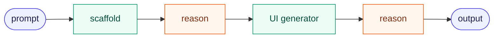
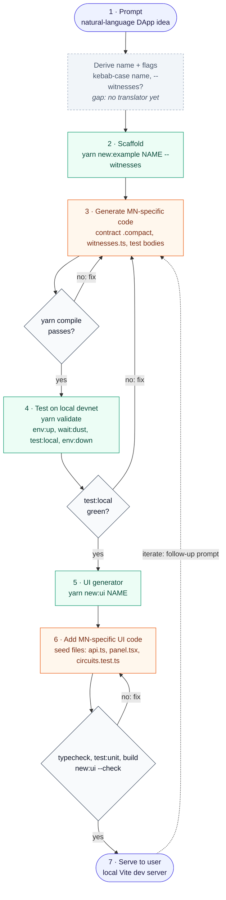

# The scripted generation pipeline

> **Status: living draft.** This is the working definition of the scripted
> generation pipeline: how a prompt becomes a running DApp using the scripts and
> references in this repo. Expect it to change as the pipeline is refined. Edit
> it here and note the change in the [changelog](#changelog).

The pipeline alternates between two kinds of work. **Scripts** are
deterministic and run with no AI. **Reasoning steps** are where a model writes
Midnight-specific code from the repo's references. Every reasoning step ends at
a mechanical gate (compile, devnet tests, typecheck/build). A failure at a gate
loops back to that reasoning step, so code only moves forward once it compiles
and runs.

## Skeleton

## Flow

Colour key: indigo marks input/output, green a deterministic script, orange a
reasoning (LLM) step, and slate a mechanical gate. Dashed grey marks a step with
nothing behind it yet.

## Steps

| # | Step | Kind | Runs | Reads | Writes | Gate |
|---|------|------|------|-------|--------|------|
| 1 | Prompt | input | — (**gap**: nothing turns a prompt into a scaffold call yet) | User prompt | Example name (kebab-case) and whether it needs witnesses | Name matches `NAME_RE` |
| 2 | Scaffold | script | `yarn new:example <name> [--witnesses] [--no-register]` ([`scripts/new-example.mjs`](../scripts/new-example.mjs)) | [`templates/example/`](../templates/example/) | `examples/<name>/`: contract stub, `src/` harness, test skeleton up to the first `deployContract`, `compose.yml`, `AGENTS.md`. Registers the example in CI and the docs tables | Node 22; no leftover template tokens |
| 3 | Generate MN-specific code | reason | Model writes code | Root [`AGENTS.md`](../AGENTS.md); the CI-tested `examples/*/` contracts, witnesses and tests; [`examples/shielded-chips/TUTORIAL.md`](../examples/shielded-chips/TUTORIAL.md) and [`LESSONS.md`](../examples/shielded-chips/LESSONS.md); toolchain pins in [`README.md`](../README.md); the `midnight-expert` skills (`compact-core`, `midnight-verify`) | `contract/<name>.compact`, `contract/witnesses.ts`, test bodies in `src/test/<name>.test.ts` | `yarn compile` (`compact compile`) passes; on failure, back to 3 |
| 4 | Test on local devnet | script | `yarn validate` = `env:up` → `wait:dust` → `test:local` → `env:down` | `examples/<name>/compose.yml` (proof server, indexer, node) | Test results | `test:local` green; on failure, back to 3. **Must pass before step 5** |
| 5 | UI generator | script | `yarn new:ui <name> [--contract <managed-dir>] [--private-state memory\|persistent]` ([`scripts/new-ui.mjs`](../scripts/new-ui.mjs)); preview with `--dry-run` | `contract/managed/<c>/compiler/contract-info.json`, `contract/managed/<c>/contract/index.d.ts`, `contract/witnesses.ts`, `contract/<c>.compact`, and [`templates/ui/`](../templates/ui/) | `examples/<name>/ui/` (Vite + React): template-owned files, seed files, `new-ui.json`, `verification.json` | Refuses when the contract isn't compiled, `ui/` already exists, or `witnesses.ts` lacks a `create<X>PrivateState` factory |
| 6 | Add MN-specific UI code | reason | Model edits seed files only | [`templates/ui/AGENTS.md`](../templates/ui/AGENTS.md) (copied into every `ui/AGENTS.md`); existing `examples/*/ui/` | `src/midnight/<name>-api.ts`, `src/components/<name>-panel.tsx`, `src/__tests__/<name>-circuits.test.ts`, `README.md` | `typecheck`, `test:unit` and `build` pass; `yarn new:ui <name> --check` shows no template drift; on failure, back to 6 |
| 7 | Serve to user | output | `yarn workspace @midnight-ntwrk/example-<name>-ui dev` (runs `copy:zk`, then Vite on :5173); `yarn fund:wallet` funds a browser wallet on devnet | Built UI, managed ZK assets | Running DApp | Browser and Lace checks recorded in `ui/verification.json` |

## Known gaps and open items

- **Prompt → scaffold (step 1).** Nothing derives the example name and
  `--witnesses` choice from a prompt yet. This is the first reasoning step.
- **No end-to-end runner.** Each step is a separate command, and `yarn validate`
  only covers step 4. Something has to chain steps 2–7 and drive the fix
  loops.
- **Serving (step 7).** Serving stops at the local Vite dev server; there is no
  deploy target in this repo.
- **Browser verification.** The checks in `verification.json` (Lace, browser)
  are run by hand. Decide which of them a pipeline can run automatically before
  serving.

## Changelog

- 2026-10-06: First draft of the 7-step flow (prompt, scaffold, generate,
  devnet test, UI generator, UI code, serve).
